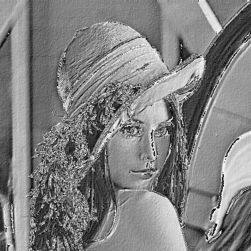
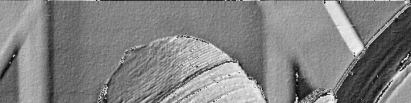
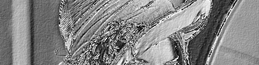
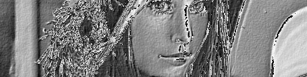
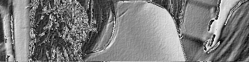
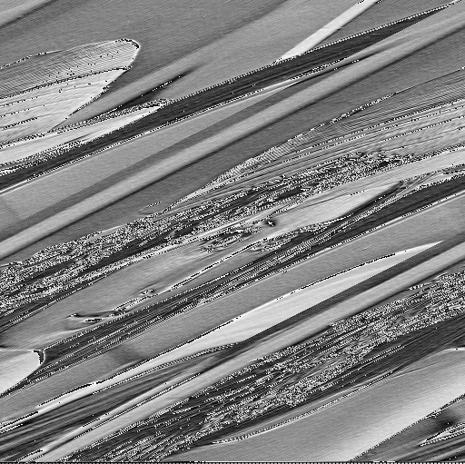

# Parallelizing Convolutions

This project aims to apply the Emboss kernel on images in both serial and parallel. Parallel versions use MPI and OpenMP.

**This code is for an assignment and is not production grade.**

Spreasheet with results (**time, speedup and efficiency**):

https://docs.google.com/spreadsheets/d/14RXUATwGfS6NzDjerQxIyk-99d9u-4Vin8MdKZ8S0VI/edit?usp=sharing

## What to expect

The result should be as below:

**Original image:**


**Processed image:**


When running the parallel version, each process will generate part of the final result, as shown below for 4 processes:


**Process 0:**


**Process 1:**


**Process 2:**


**Process 3:**


## How it works

## How To

### Compile
To compile, run `make all`

### Run in serial
To run the serial version on an example image, run:
`./build/serial images/lena.bmp lena_serial.bmp`

### Run in parallel with MPI

To run a parallel version of the algorithm using MPI with 4 processes, run:
`mpirun -n 4 ./build/parallel-mpi images/lena.bmp lena_mpi.bmp`

To make each process output its partial result, use `verbose` as shown below:
`mpirun -n 4 ./build/parallel-mpi images/lena.bmp lena_mpi.bmp verbose`

### Run in parallel with MPI and OpenMP
To run a parallel version of the algorithm using MPI an OpenMP with 4 processes, run:
`mpirun -n 4 ./build/parallel-mpiomp images/lena.bmp lena_mpi_omp.bmp`

### Generate random images
To generate random images with noise for testing purposes, run `./make-images.sh`

### Run experiments
To run experiments and print average time spent processing images generated in the step above, run `fire` scripts:

``` .sh
# Serial
./fire.sh

# MPI
./fire-mpi.sh

# OpenMP
./fire-omp.sh

# MPI+OpenMP
./fire-mpiomp.sh

```


## Known bugs
### Distorced images with MPI

*Problem:*  When using the MPI version, the final image looks distorted.

*Root cause:* Processes 0 and N-2 deliver more pixels then they should ahte they are used to assemble the final image.

*Resolution date:* Probably after the end of this semester when I manage to finish other assignments.

<!--
This is how it should look like:

**Distorced:**
 -->

### Segfault with MPI and OpenMP

*Problem:* When using MPI and OpenMP together the application *might* eventually end unexpectedly.

*Root cause:* The reason was not found yet.

## Future work

I plan to fix bugs and separate the code for Bitmap manipulation from the application code as a lib.
